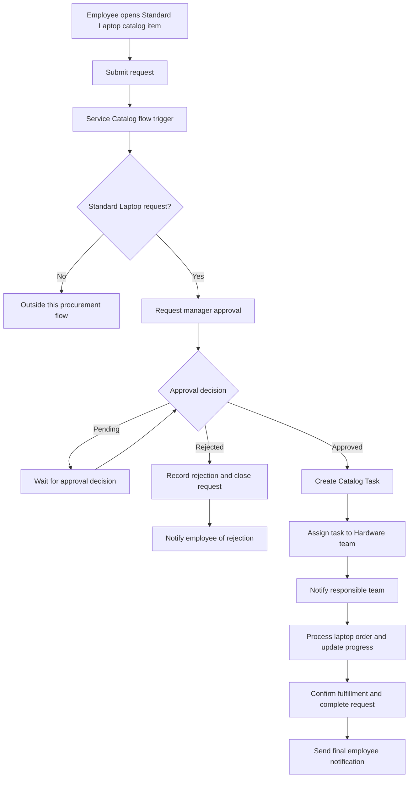

# Streamlining IT Procurement: Automating Standard Laptop Order with Flow Designer

## Consolidated Project Report

| Project attribute | Details |
| --- | --- |
| Platform | ServiceNow |
| Automation technology | Flow Designer |
| Service Catalog item | Standard Laptop |
| Business area | IT procurement and hardware fulfillment |
| Team leader | Harrish K |
| Team size | 5 members |
| Report basis | Consolidation of 8 project lifecycle documents |
| Repository | [View GitHub repository](https://github.com/Harrish6/Streamlining-IT-Procurements-Automating-Standard-Laptop-Orders-with-Flow-Designer) |
| Demonstration | [View demonstration video](https://drive.google.com/file/d/1C1hxLEp8mNOSrWLnhSFai05E7qrfuUYA/view?usp=drivesdk) |

> **Scope of evidence:** This report consolidates the eight supplied Word documents. Requirements, intended behavior, documented configuration, and reported outcomes are distinguished where necessary. The repository contents, live ServiceNow instance, and linked demonstration video were not independently inspected. No measured performance gains or independently verified test results are claimed.

## Table of Contents

| Section | Topic |
| --- | --- |
| 1 | [Executive Summary](#1-executive-summary) |
| 2 | [Problem Statement and Motivation](#2-problem-statement-and-motivation) |
| 3 | [Objectives and Scope](#3-objectives-and-scope) |
| 4 | [Team and Project Planning](#4-team-and-project-planning) |
| 5 | [Requirements Analysis](#5-requirements-analysis) |
| 6 | [System Architecture and Workflow](#6-system-architecture-and-workflow) |
| 7 | [Implementation and Configuration](#7-implementation-and-configuration) |
| 8 | [Testing and Validation](#8-testing-and-validation) |
| 9 | [Demonstration and User Journey](#9-demonstration-and-user-journey) |
| 10 | [Results and Benefits](#10-results-and-benefits) |
| 11 | [Limitations, Risks, and Future Enhancements](#11-limitations-risks-and-future-enhancements) |
| 12 | [Repository Documentation and Maintenance](#12-repository-documentation-and-maintenance) |
| 13 | [Conclusion](#13-conclusion) |
| 14 | [Source Documents and References](#14-source-documents-and-references) |

## 1. Executive Summary

This project addresses the coordination effort involved in standard laptop procurement by connecting ServiceNow Service Catalog requests with Flow Designer automation. Employees request a Standard Laptop through a catalog item, and the intended workflow routes the request for approval before creating a fulfillment task for the responsible hardware team.

The overall design covers request submission, request evaluation, approval or rejection, catalog-task creation, task assignment, notifications, status updates, and completion. The detailed implementation instructions specifically describe a Service Catalog-triggered flow that creates a Catalog Task linked to the Requested Item, supplies a short description and description, and assigns the task to the **Hardware** group.

The project demonstrates the value of low-code workflow automation for repetitive IT service activities. Instead of relying on a team member to manually create and route a hardware configuration task, the configured flow provides a consistent task-creation mechanism associated with the employee's request.

The lifecycle documents report successful implementation of the broader workflow. However, the practical configuration guide does not show every approval, notification, rejection, or closure action described in the design. This report therefore presents the end-to-end process as the documented target and identifies the implementation evidence needed to verify its complete execution.

## 2. Problem Statement and Motivation

Employees may need laptops when joining an organization, replacing an old device, or meeting a new work requirement. A manual procurement process requires coordination between employees, approvers, IT staff, and procurement personnel.

| Manual activity | Operational problem |
| --- | --- |
| Submitting and reviewing requests | Required information may be incomplete or handled inconsistently. |
| Obtaining manager approval | Follow-up can depend on manual coordination. |
| Creating procurement tasks | Repetitive work increases the opportunity for missed requests. |
| Assigning work to the responsible team | Incorrect routing can delay fulfillment. |
| Updating request progress | Employees may lack visibility into the current stage. |
| Sending progress messages | Important updates may be missed or delayed. |
| Confirming completion | Request closure may be disconnected from fulfillment progress. |

The central problem is not only ordering a device; it is ensuring that the associated service request follows a consistent, visible, and controlled process. ServiceNow provides a shared environment in which the catalog request and its fulfillment task can remain connected.

## 3. Objectives and Scope

### 3.1 Project Objectives

| Objective | Intended outcome |
| --- | --- |
| Standardize request submission | Employees use a predefined Standard Laptop catalog item. |
| Automate workflow initiation | Submission starts the configured Service Catalog flow. |
| Enforce approval handling | Approved requests proceed; rejected requests do not enter procurement. |
| Automate task creation | A Catalog Task is created for the associated Requested Item. |
| Route fulfillment work | The task is assigned to the Hardware or designated procurement team. |
| Improve communication | Relevant users receive updates at important stages. |
| Improve traceability | Request progress and fulfillment work can be followed together. |
| Support consistent completion | Fulfilled requests reach a defined final state. |

### 3.2 Scope Boundaries

The documented scope concerns a predefined standard laptop request within ServiceNow. It includes the Service Catalog, approval handling, Flow Designer, Catalog Tasks, task assignment, progress communication, and request completion.

The documents do not establish supplier ordering integration, payment processing, inventory synchronization, asset registration, or an enterprise-wide procurement rollout. These capabilities must not be represented as delivered features. The operational act of processing the laptop order remains the responsibility of the IT or procurement team unless further automation is configured.

### 3.3 Standard Laptop Example

| Field | Example from requirements |
| --- | --- |
| Laptop Type | Standard Laptop |
| Laptop Model | Standard Business Laptop |
| Quantity | 1 |

These values are examples, not evidence of a specific manufacturer, hardware specification, or enforced quantity restriction.

## 4. Team and Project Planning

### 4.1 Team Responsibilities

The planning document identifies five team members and assigns work as follows.

| Team member | Role or assigned responsibility |
| --- | --- |
| Harrish K | Team leader; project documentation and outcome |
| Ranjith E | Standard Laptop Service Catalog, ordering, and approval |
| Raguram E | Standard Laptop Service Catalog, ordering, and approval |
| Prakash K | Flow assignment to the Standard Laptop Service Catalog |
| Deva Anandh M | Flow and Catalog Task configuration |

### 4.2 Development Plan

| Phase | Planned task |
| --- | --- |
| 1 | Create the Standard Laptop Service Catalog item. |
| 2 | Configure the Service Catalog for placing orders. |
| 3 | Configure approval for the service request. |
| 4 | Create a flow for the Standard Laptop catalog item. |
| 5 | Configure the flow trigger. |
| 6 | Configure the flow to run after approval. |
| 7 | Create the Catalog Task. |
| 8 | Update the short description after approval. |
| 9 | Assign the Catalog Task to the Hardware assignment group. |
| 10 | Test flow assignment. |
| 11 | Document results. |
| 12 | Demonstrate the project. |

The plan establishes a task sequence, but does not supply dates, durations, effort estimates, costs, or milestone acceptance records. It should therefore be read as a work breakdown rather than a dated delivery schedule.

## 5. Requirements Analysis

### 5.1 Functional Requirements

The identifiers below are report-level references introduced for traceability; they are not identifiers from the original documents.

| ID | Requirement |
| --- | --- |
| FR-01 | Allow an employee to submit a Standard Laptop order through ServiceNow. |
| FR-02 | Collect the necessary laptop request information. |
| FR-03 | Automatically trigger the procurement workflow when a request is submitted. |
| FR-04 | Route the request to the appropriate manager or approver. |
| FR-05 | Allow the approver to approve or reject the request. |
| FR-06 | Continue approved requests to procurement. |
| FR-07 | Create a procurement task for the IT or procurement team. |
| FR-08 | Notify the procurement team about the request. |
| FR-09 | Update request status at the relevant stages. |
| FR-10 | Notify the employee about important updates. |
| FR-11 | Handle rejected requests without continuing procurement. |
| FR-12 | Mark the request completed after the laptop order is processed. |

### 5.2 Data Requirements

| Field | Purpose |
| --- | --- |
| Requested For | Identifies the employee for whom the laptop is requested. |
| Laptop Type | Identifies the requested laptop category. |
| Laptop Model | Identifies the standard laptop model. |
| Quantity | Records the number of laptops requested. |
| Business Justification | Captures the reason for the request. |
| Delivery Location | Records where the laptop should be delivered. |
| Request Date | Records when the request was raised. |
| Approval Status | Represents the approval outcome or current approval stage. |
| Procurement Status | Represents the current procurement stage. |
| Request Status | Represents the overall request lifecycle state. |

These are logical data requirements. The sources do not specify technical field names, variable types, mandatory settings, default rules, or validation constraints. They also do not establish whether every field is user-entered, automatically populated, or stored on the same record.

### 5.3 Users and Access

| User role | Required access and responsibility |
| --- | --- |
| Employee | Submit requests, provide required information, track progress, and receive notifications. |
| Manager / Approver | Review the request and approve or reject it. |
| IT / Procurement Team | Receive approved work, process the order, update procurement progress, and complete the task. |
| Administrator | Configure and maintain the catalog, flow, approvals, and notifications. |

Exact ServiceNow roles and access-control rules are not documented. Business-role descriptions should not be treated as verified platform permissions.

### 5.4 Non-Functional Requirements

| Quality attribute | Requirement |
| --- | --- |
| Usability | Keep the request process straightforward for employees. |
| Reliability | Execute the defined workflow consistently. |
| Automation | Reduce repetitive procurement administration. |
| Tracking | Make request progress visible to authorized users. |
| Maintainability | Allow the flow to be maintained and modified. |
| Security | Restrict access according to user responsibilities. |
| Consistency | Apply a predefined process to standard laptop requests. |
| Communication | Inform users about relevant request updates. |

These are qualitative requirements. No numerical availability target, response-time threshold, service-level agreement, or load-test target is supplied.

## 6. System Architecture and Workflow

### 6.1 Architecture Components

| Component | Responsibility |
| --- | --- |
| Service Catalog | Provides the employee-facing Standard Laptop order entry point. |
| Requested Item | Represents the requested catalog item and provides the record reference used by task creation. |
| Flow Designer | Coordinates the configured automation. |
| Approval process | Determines whether procurement may proceed. |
| Catalog Task | Represents fulfillment or configuration work associated with the Requested Item. |
| Hardware assignment group | Receives the task in the detailed configuration. |
| Notifications | Communicate important request events in the intended end-to-end process. |
| Status updates | Represent approval, procurement, and completion progress. |

### 6.2 Intended End-to-End Flow

The diagram represents the design described across the lifecycle documents, not an independently verified export of the configured flow. Handling of nonmatching items is a scope guard; its exact implementation is not specified.



### 6.3 Request Lifecycle

| Approved-path sequence | Business status | Meaning |
| --- | --- | --- |
| 1 | Requested | The employee has submitted the request. |
| 2 | Approval Pending | The request awaits the approver's decision. |
| 3 | Approved | Procurement is authorized to proceed. |
| 4 | Procurement Processing | The responsible team is working on the order. |
| 5 | Ordered | The laptop order has been placed. |
| 6 | Delivered | The laptop has been delivered. |
| 7 | Completed | The request lifecycle is complete. |

| Rejected-path sequence | Business status |
| --- | --- |
| 1 | Requested |
| 2 | Approval Pending |
| 3 | Rejected |
| 4 | Closed |

These labels come from the design document. They are business lifecycle descriptions, not verified ServiceNow choice values. Mapping them to actual request, Requested Item, approval, and task fields requires instance-specific configuration. A task entering a terminal state should not automatically be interpreted as successful delivery without an appropriate completion rule.

## 7. Implementation and Configuration

### 7.1 Naming and Terminology

| Context | Name used in sources |
| --- | --- |
| Overall automation in development documentation | Standard Laptop Procurement Automation |
| Flow creation in the practical guide | Standard laptop task |
| Flow association in the practical guide | Standard Laptop Task |
| Catalog item | Standard Laptop |
| Configured assignment group | Hardware |
| Broader fulfillment team description | Hardware / Procurement or IT / Procurement |

This report uses **Standard Laptop Procurement Automation** for the overall solution and **Standard Laptop Task** for the practical flow configuration. These names are not evidence that multiple flows exist. Confirm the actual record name in the instance before associating or modifying the flow.

### 7.2 Configuration Prerequisites

The following are practical prerequisites inferred from the documented steps, rather than a supplied installation checklist.

| Prerequisite | Reason |
| --- | --- |
| Authorized ServiceNow access | Catalog and flow configuration require suitable permissions. |
| Flow Designer availability | The solution is configured through Flow Designer. |
| Standard Laptop catalog item | The flow is associated with this item. |
| Hardware assignment group | Task assignment uses this group in the guide. |
| Test requester and approver | Approval and rejection scenarios require appropriate test users. |
| Notification configuration | Delivery testing requires working channels and valid recipients. |
| Non-production validation environment | Recommended before changing existing catalog automation. |

The instance release, plugins, license requirements, and exact role assignments are not provided. Menu labels and available configuration options may vary by instance.

### 7.3 Activity 1: Create the Flow

| Step | Configuration action from the practical guide |
| --- | --- |
| 1 | Open ServiceNow and search for **Flow Designer** in the All menu. |
| 2 | Open **Flow Designer** under **Process Automation**. |
| 3 | Select **New**, then **Flow**. |
| 4 | Enter the flow name **Standard laptop task**. |
| 5 | Set the application to **Global**. |
| 6 | Select **System user** as the run user. |
| 7 | Submit the flow properties. |
| 8 | Add a trigger and select **Service Catalog**. |
| 9 | Confirm the trigger configuration. |
| 10 | Add the **Create Catalog Task** action. |
| 11 | Populate the action fields as documented below. |
| 12 | Save the flow and activate it. |

### 7.4 Catalog Task Action Fields

| Setting | Documented value or mapping |
| --- | --- |
| Action | Create Catalog Task |
| Request item | Drag the trigger's Requested Item Record into the Request item input. |
| Table | Catalog Task; described as automatically populated. |
| Short description | `Laptop need to Configured` |
| Description | `Laptop need to Configured` |
| Assignment group | `Hardware` |
| Approval | `Approved` |
| Remaining settings | Left at default in the practical guide. |

The description text is retained exactly for configuration fidelity, despite its grammatical error. A revised description such as `Laptop needs to be configured` would be an optional wording change, not the value documented in the source.

> **Approval control distinction:** Setting the created task's Approval field to `Approved` is not equivalent to obtaining manager approval for the request. The practical action list does not show an approval action, a wait for a decision, or a condition enforcing approval before task creation. The source conclusion describes approval-first behavior, but its actual control must be verified separately in the flow or other approval configuration.

Running as **System user** is also a documented setting, not a least-privilege recommendation. Review the execution context and its access implications before production deployment.

### 7.5 Activity 2: Associate the Flow with the Catalog Item

| Step | Configuration action from the practical guide |
| --- | --- |
| 1 | Search for **Maintain Items** in ServiceNow. |
| 2 | Open the **Standard Laptop** record. |
| 3 | Locate the **Process engine** section. |
| 4 | Associate the newly created **Standard Laptop Task** flow. |
| 5 | Save the catalog item. |

The source instructs removing remaining automations before adding the flow. Before doing so, review and preserve existing behavior: removing an approval workflow or fulfillment process could change request handling. Record the previous configuration, identify dependencies, and validate the replacement in a non-production environment. These safeguards are recommendations added to this report.

### 7.6 Activity 3: Submit and Inspect a Request

| Step | Verification action |
| --- | --- |
| 1 | Open **Service Catalog**. |
| 2 | Select the **Hardware** category. |
| 3 | Open **Standard Laptop** and provide the required details. |
| 4 | Select **Order Now**. |
| 5 | Open the request number shown on the order-status page. |
| 6 | Inspect the **Approvers** section where applicable. |
| 7 | Open the associated **Requested Item**. |
| 8 | Open the **Catalog tasks** related section. |
| 9 | Inspect the created task's short description, assignment group, and status. |

Repeated navigation lines in the original practical guide have been consolidated. The documents do not provide record identifiers, execution logs, or screenshots accompanying these steps.

### 7.7 Intended Capabilities and Configuration Coverage

| Capability | Evidence in supplied documents | Verification still needed |
| --- | --- | --- |
| Service Catalog trigger | Explicitly configured in the practical guide. | Confirm the active flow and catalog association in the instance. |
| Standard Laptop condition | Described in design and development. | Confirm the actual condition or equivalent item-specific trigger scope. |
| Manager approval | Required and described in narrative. | Confirm approver selection and the approval gate. |
| Rejection handling | Described in design and development. | Confirm rejection prevents task creation and closes the intended record. |
| Catalog Task creation | Explicit action and field mappings provided. | Inspect a created task and its Requested Item reference. |
| Hardware assignment | Explicitly configured. | Confirm the group is active and can access assigned work. |
| Notifications | Described throughout the lifecycle documents. | Confirm events, recipients, templates, and delivery evidence. |
| Status progression | Business stages described. | Confirm field mappings and transition conditions. |
| Completion | Described in the target process. | Confirm completion criteria and final notification behavior. |

## 8. Testing and Validation

### 8.1 Test Approach and Evidence Status

The testing document defines eight functional scenarios and states that testing verifies the workflow. It provides expected outcomes, but no dated execution records, actual-result columns, pass/fail evidence, defect records, or screenshots. The following matrix preserves the supplied scenarios and expands their procedures for reproducibility; it does not invent execution results.

### 8.2 Functional Test Matrix

| Test ID | Scenario | Procedure | Expected result | Evidence status |
| --- | --- | --- | --- | --- |
| TC-01 | Standard Laptop request | Submit the catalog item with required details. | A request is successfully created and submitted. | Expected result documented; actual result not supplied. |
| TC-02 | Approval request | Inspect the approval generated for the submitted request. | The request reaches the appropriate manager or approver. | Expected result documented; actual result not supplied. |
| TC-03 | Approved request | Approve a pending request and inspect subsequent execution. | The workflow continues to the next stage. | Expected result documented; actual result not supplied. |
| TC-04 | Rejected request | Reject a pending request and inspect downstream work. | Procurement stops and rejection is handled correctly. | Expected result documented; actual result not supplied. |
| TC-05 | Procurement task | Inspect the Requested Item after approval. | A Catalog Task is created and assigned to Hardware or Procurement. | Expected result documented; actual result not supplied. |
| TC-06 | Notification | Inspect notifications for relevant workflow events. | Intended users receive progress updates. | Expected result documented; actual result not supplied. |
| TC-07 | Status update | Inspect record statuses during the lifecycle. | Status reflects the correct procurement stage. | Expected result documented; actual result not supplied. |
| TC-08 | Completion | Complete fulfillment and inspect the request and final message. | The request reaches completion and the employee is notified. | Expected result documented; actual result not supplied. |

### 8.3 Requirements-to-Test Traceability

| Requirement | Relevant test coverage | Coverage qualification |
| --- | --- | --- |
| FR-01 | TC-01 | Covers request submission. |
| FR-02 | TC-01 | Covers entering details; field-level validation is not separately defined. |
| FR-03 | TC-01 | Needs flow-execution inspection to verify automatic triggering explicitly. |
| FR-04 | TC-02 | Covers approval routing. |
| FR-05 | TC-03 and TC-04 | Covers both approval decisions. |
| FR-06 | TC-03 | Covers continuation after approval. |
| FR-07 | TC-05 | Covers task creation and assignment. |
| FR-08 | TC-06 | Covers procurement-team notification. |
| FR-09 | TC-07 | Covers lifecycle status updates. |
| FR-10 | TC-06 and TC-08 | Covers employee updates and the final notification. |
| FR-11 | TC-04 | Covers stopping procurement on rejection. |
| FR-12 | TC-08 | Covers completion behavior. |

### 8.4 Recommended Additional Tests

These tests are recommendations, not reported project executions.

| Additional scenario | Acceptance expectation |
| --- | --- |
| Request remains pending | No procurement task is created before authorization. |
| Missing approver | The request does not silently bypass approval; an actionable exception is visible. |
| Nonstandard catalog item | The item does not incorrectly enter the Standard Laptop workflow. |
| Missing mandatory information | Submission follows the configured validation rules. |
| Duplicate event or flow retry | Duplicate fulfillment tasks are prevented or handled explicitly. |
| Inactive assignment group | The issue is visible rather than silently leaving work unowned. |
| Notification failure | Delivery problems can be diagnosed without falsely assuming receipt. |
| Unauthorized record access | Users cannot view or modify records outside their permitted scope. |
| Cancelled or unsuccessful task | The request is not automatically reported as successfully delivered. |
| Existing catalog automation | Flow association does not unintentionally remove required behavior. |

### 8.5 Evidence to Retain

For each executed test, record the test ID, execution date, tester, input request reference, expected result, actual result, outcome, and supporting evidence. Use separate approved and rejected requests. Capture flow execution details, task linkage, assignment, relevant status changes, and notification evidence. Remove personal information and sensitive instance details before publishing evidence to GitHub.

## 9. Demonstration and User Journey

The demonstration document describes a video covering the complete workflow. The link is preserved below; its contents have not been independently verified for this report.

**Demo video:** [Standard Laptop Procurement Automation demonstration](https://drive.google.com/file/d/1C1hxLEp8mNOSrWLnhSFai05E7qrfuUYA/view?usp=drivesdk)

The documented walkthrough progresses from employee ordering to administrator inspection of the flow, approver action, hardware-task creation, status changes, and completion. The next section records all demonstration steps supplied in the source.

| Demo step | Activity described in the demonstration document |
| --- | --- |
| 1 | Log in to ServiceNow. |
| 2 | Open the Service Catalog. |
| 3 | Select the Standard Laptop catalog item. |
| 4 | Enter the required request details. |
| 5 | Submit the laptop order. |
| 6 | Show the submitted service request. |
| 7 | Open Flow Designer. |
| 8 | Show the Standard Laptop Procurement Automation flow. |
| 9 | Show the trigger and request condition. |
| 10 | Demonstrate the approval process. |
| 11 | Approve the laptop request. |
| 12 | Show the automatically created Catalog Task. |
| 13 | Show Hardware or Procurement assignment. |
| 14 | Show status updates and notifications. |
| 15 | Complete the procurement request. |
| 16 | Show the final project outcome. |

### 9.1 User Experience

The employee interacts primarily with the catalog and request status. The approver reviews the request and records a decision. The hardware team receives the associated fulfillment work and processes the laptop order. The administrator maintains the catalog-to-flow relationship and investigates execution issues.

A complete demonstration should make the approval gate visible rather than showing only an already-approved task. It should also distinguish a successfully created task from a successfully completed procurement request. These are recommended evidence improvements, not additional claims about the linked video.

## 10. Results and Benefits

### 10.1 Documented Results

The development and demonstration documents report an automated workflow spanning request submission through completion. The practical documentation provides the strongest configuration detail for automatically creating a Catalog Task with a predefined description and routing it to Hardware.

The central documented contribution is a repeatable relationship between a Standard Laptop order and its hardware fulfillment task. This reduces reliance on manually entering and assigning the same task for each request.

| Benefit | How the design supports it | Qualification |
| --- | --- | --- |
| Reduced manual effort | Creates and assigns repetitive fulfillment tasks automatically. | No effort baseline or measured time saving is supplied. |
| Faster processing | Reduces manual handoffs during task creation and routing. | No cycle-time measurements are supplied. |
| Better request tracking | Connects the request with its fulfillment work and intended statuses. | Full transition configuration is not shown. |
| Consistent procurement procedures | Uses a predefined catalog item and flow. | Exceptions and duplicate-execution behavior need validation. |
| Improved team communication | Includes progress notifications in the design. | Delivery evidence is not supplied. |
| Automatic task creation and assignment | Uses Create Catalog Task with Hardware assignment. | Configuration steps are supplied; live execution was not inspected. |
| Timely notifications | Plans messages at relevant lifecycle stages. | No notification timing metrics are supplied. |
| Clear approval handling | Defines approved and rejected branches. | Actual approval enforcement needs verification. |
| Better progress visibility | Defines business stages from Requested to Completed. | Instance field mappings are not supplied. |
| More organized IT procurement | Brings request, approval, and fulfillment into one process design. | Supplier and financial processing are not established as automated. |

### 10.2 Suggested Future Measurement

A later evaluation could compare a manual baseline with the automated process using consistent definitions and similar request volumes. Suggested metrics are request-to-approval time, approval-to-task-creation time, end-to-end fulfillment time, manual interventions per request, task-assignment accuracy, notification delivery success, and duplicate-task frequency. No numeric values are assigned because the sources contain no measurements.

## 11. Limitations, Risks, and Future Enhancements

### 11.1 Documentation and Implementation Gaps

| Gap or risk | Significance | Recommended action |
| --- | --- | --- |
| Different flow names across documents | Makes reproduction and maintenance ambiguous. | Confirm and consistently document the actual flow record. |
| Approval gate absent from practical steps | A task marked Approved does not prove authorization occurred. | Verify the real approval action and branching before task creation. |
| Notifications described without setup detail | Intended recipients and delivery behavior cannot be reproduced precisely. | Document events, templates, recipient rules, and delivery tests. |
| Business statuses lack technical mapping | State descriptions cannot be assumed to match platform fields. | Document affected records, fields, values, and transition rules. |
| Closure rules are unspecified | Failed or cancelled work could be confused with successful fulfillment. | Define completion criteria and unsuccessful terminal paths. |
| System-user execution | The flow may execute with elevated access. | Review execution privileges and access controls. |
| Removal of existing automation | Could remove approval or other required processing. | Review dependencies and preserve a rollback configuration. |
| Missing test execution evidence | The report cannot independently substantiate pass/fail claims. | Retain test records and sanitized execution evidence. |
| Missing environment and deployment details | Reproduction across instances may differ. | Record the release, dependencies, and supported deployment process. |
| No cost or performance baseline | Quantitative business impact cannot be calculated. | Collect baseline and post-implementation measurements. |

### 11.2 Future Enhancements

The following are proposed extensions, not delivered functionality established by the documents.

| Enhancement | Potential value |
| --- | --- |
| Approval reminders and escalation | Reduces delays from unattended approvals. |
| Inventory availability checks | Helps determine whether an existing device can satisfy the request. |
| Asset-management integration | Connects fulfilled devices to asset ownership and lifecycle records. |
| Supplier-order integration | Extends automation beyond internal task routing. |
| Multiple laptop categories | Supports different device needs with explicit eligibility rules. |
| SLA tracking and reporting | Makes approval and fulfillment delays measurable. |
| Retry and exception handling | Improves recovery from failed workflow actions. |
| Duplicate-task prevention | Reduces repeated fulfillment work after retries or reprocessing. |
| Employee delivery acknowledgment | Provides explicit evidence of receipt before closure. |
| Procurement analytics | Identifies request volumes, delays, and operational bottlenecks. |

## 12. Repository Documentation and Maintenance

### 12.1 GitHub Placement

**Project repository:** [Streamlining IT Procurements — Standard Laptop Orders with Flow Designer](https://github.com/Harrish6/Streamlining-IT-Procurements-Automating-Standard-Laptop-Orders-with-Flow-Designer)

Place this file at the repository root as `PROJECT_REPORT.md`. A short `README.md` can introduce the project and link to this detailed report using:

```markdown
[Read the detailed project report](PROJECT_REPORT.md)
```

The demonstration document explicitly requires all phase folders to remain directly under the repository root. **Do not create an additional Project Development folder inside `05_Project_Development`.**

The layout below is an illustrative organization consistent with that requirement, not a verified listing of the current repository. Preserve actual existing folder names when they differ.

```text
repository-root/
├── README.md
├── PROJECT_REPORT.md
├── 01_Brainstorming_and_Ideation/
├── 02_Requirement_Analysis/
├── 03_Project_Design/
├── 04_Project_Planning/
├── 05_Project_Development/
├── 06_Project_Testing/
├── 07_Project_Documentation/
└── 08_Project_Demonstration/
```

### 12.2 Publication Considerations

| Consideration | Guidance |
| --- | --- |
| Report format | Use the supplied Markdown file for GitHub rendering. |
| Workflow diagram | The Mermaid source is included directly in the report. |
| Source traceability | Retain the lifecycle documents in the relevant phase folders. |
| Screenshots | Publish only genuine, sanitized project evidence; no screenshots were supplied for this consolidation. |
| Demonstration access | Confirm that intended viewers can access the linked video. |
| Sensitive information | Exclude credentials, access tokens, personal request data, and internal instance information. |
| Deployment artifacts | Add approved configuration exports only if available and safe to share. |
| Licensing | Choose a repository license separately; none is specified in the documents. |

### 12.3 Maintenance and Change Control

Changes to catalog variables, assignment groups, approval rules, or task-state mappings can affect consumers of the workflow. After a change, repeat the approved and rejected request tests, verify task linkage and routing, and confirm notifications and completion behavior.

Maintain a record of the catalog-to-flow association and previous automation settings so changes can be reviewed or reversed. Where possible, keep configuration changes focused and validate them in a non-production instance before activation in production.

The source documents do not include an update set, application package, import instructions, scripts, or automated test suite. This repository should not be described as a one-command deployment package based solely on the supplied material.

## 13. Conclusion

The Standard Laptop Procurement Automation project applies ServiceNow Flow Designer to a common IT service challenge: turning employee laptop requests into consistent, trackable fulfillment work. Its design brings together catalog submission, approval decisions, task creation, assignment, notifications, progress updates, and completion.

The detailed practical guide establishes a Service Catalog-triggered Catalog Task configuration linked to the Requested Item and assigned to Hardware. This is the clearest documented implementation contribution. The broader lifecycle documents describe and report a complete approval-to-completion process, but additional configuration records and test evidence are needed to substantiate every stage independently.

Overall, the project provides a useful foundation for reducing repetitive IT procurement administration and improving request coordination. Clear approval enforcement, explicit state mappings, reliable notifications, and retained execution evidence would strengthen both the implementation and its reproducibility for future maintainers.

## 14. Source Documents and References

### 14.1 Supplied Project Documents

All eight supplied Word documents were reviewed for this consolidation.

| Reference | Source document | Contribution to this report |
| --- | --- | --- |
| S1 | `01_Brainstorming_and_Ideation.docx` | Project title, business problem, proposed solution, objectives, and expected benefits. |
| S2 | `02_Requirement_Analysis.docx` | Functional requirements, data fields, users, access needs, non-functional requirements, and example laptop values. |
| S3 | `03_Project_Design.docx` | Architecture, flow components, approval branches, and business status sequences. |
| S4 | `04_Project_Planning1.docx` | Twelve-phase development plan, team membership, and responsibility assignments. |
| S5 | `05_Project_Development.docx` | Narrative implementation, automation name, trigger, request condition, and end-to-end flow. |
| S6 | `06_Project_Testing.docx` | Eight test scenarios and their expected outcomes. |
| S7 | `07_Project_Documentation.docx` | Practical Flow Designer setup, Catalog Task field values, catalog association, verification navigation, and implementation conclusion. |
| S8 | `08_Project_Demonstration1.docx` | Demonstration sequence, reported outcome, video link, repository link, and root-folder requirement. |

### 14.2 Evidence Reconciliation

| Source difference | Treatment in this report |
| --- | --- |
| Broad end-to-end claims versus narrower configuration steps | Presented intended behavior separately from explicit configuration detail. |
| Standard Laptop Procurement Automation versus Standard Laptop Task | Retained both names with their source context. |
| Hardware versus Hardware / Procurement | Used Hardware for the explicit assignment and broader terminology for business responsibilities. |
| Approval-first narrative versus an Approved task-field value | Explicitly identified the need to verify a real approval gate. |
| Test summary without actual-result evidence | Preserved expected results without inventing pass/fail outcomes. |
| Repeated navigation lines | Consolidated duplicates without removing meaningful actions. |
| Generic laptop model and quantity example | Retained as examples rather than fixed hardware or validation requirements. |

### 14.3 External Project Links

| Resource | Link |
| --- | --- |
| GitHub repository | https://github.com/Harrish6/Streamlining-IT-Procurements-Automating-Standard-Laptop-Orders-with-Flow-Designer |
| Demonstration video | https://drive.google.com/file/d/1C1hxLEp8mNOSrWLnhSFai05E7qrfuUYA/view?usp=drivesdk |

---

*This report consolidates the supplied project materials into a single GitHub-ready document. Additional implementation guidance, verification recommendations, and future enhancements are identified as such rather than represented as completed project work.*
